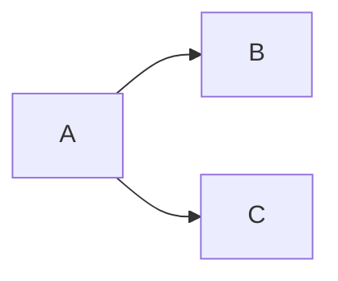

# Example Package

This is a simple example package.
[Github-flavored Markdown](https://guides.github.com/features/mastering-markdown/)

https://packaging.python.org/en/latest/tutorials/packaging-projects/

https://packaging.python.org/en/latest/tutorials/creating-documentation/

# Visuals & Diagrams
https://mermaid.js.org/config/Tutorials.html
