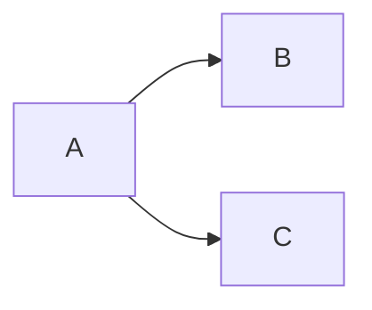

# Vehicles
Just getting going with this --
Based on Braitenberg's Vehicles concept, this is a libray containing some 
specific flavors of neural network architecutres, simulated environemnts 
and entity objects

## Entity
- Entity holds the vehicle-specific classes, operations and processes, 
  including the entity definition, senses, and actions

## World
- World holds the pygame visualization, step update
- For now, I just dumped in the pygame froggerbot implementation -- it's 
  super messy.

# Visuals & Diagrams
https://mermaid.js.org/config/Tutorials.html

```mermaid
flowchart LR;
    A --> B;
    A --> C;
```